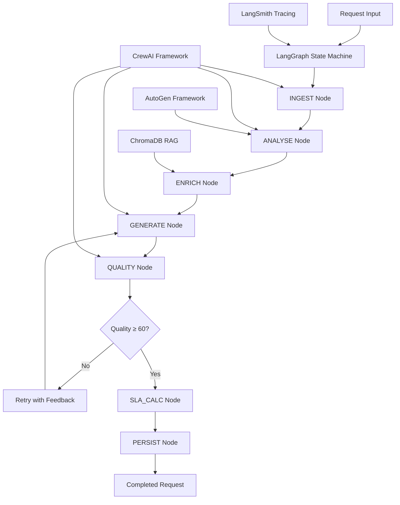
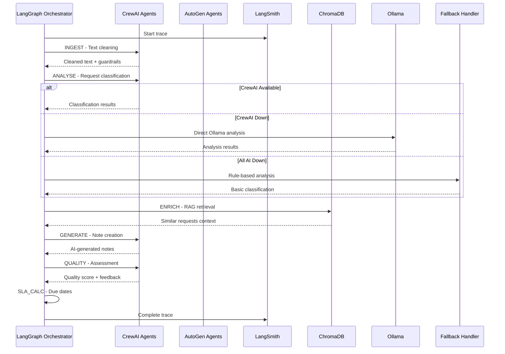

# NEXUS SDLC - AI Pipeline Detailed Flow Documentation

## Document Information
- **Version**: 1.0
- **Date**: March 2026
- **Author**: GenAI Architect Team
- **Project**: NEXUS SDLC - AI-Assisted Internal Request Management System

---

## 1. Executive Summary

This document provides an in-depth explanation of the AI pipeline flow in the NEXUS SDLC system, detailing how multiple AI frameworks (CrewAI, AutoGen, LangGraph) work together to process requests intelligently. The pipeline implements a sophisticated state machine that ensures high-quality output through self-correction mechanisms and graceful degradation.

---

## 2. AI Pipeline Architecture Overview

### 2.1 High-Level Pipeline Flow



### 2.2 AI Framework Integration



---

## 3. Detailed AI Pipeline Nodes

### 3.1 INGEST Node - Text Processing & Guardrails

#### 3.1.1 Purpose
The INGEST node is responsible for processing raw user input and preparing it for AI analysis. This node ensures data quality, security, and compliance before any AI processing occurs.

#### 3.1.2 Processing Steps

```python
async def _node_ingest(state: GraphState, queue: Optional[asyncio.Queue]) -> GraphState:
    # 1. Retrieve raw description
    raw = state.get("raw_description", "")
    
    # 2. Apply guardrails and content filtering
    guardrail_result = guard_request_text(raw[: settings.AI_INPUT_MAX_CHARS])
    
    # 3. Clean and normalize text
    cleaned = guardrail_result.cleaned_text
    redacted = guardrail_result.redacted_text
    
    # 4. Update state with processed data
    state["cleaned_text"] = cleaned
    state["redacted_text"] = redacted
    state["guardrails"] = {
        "detected_pii": guardrail_result.detected_pii,
        "jailbreak_detected": guardrail_result.jailbreak_detected,
        "exfiltration_detected": guardrail_result.exfiltration_detected,
        "tool_misuse_detected": guardrail_result.tool_misuse_detected,
        "model_misuse_detected": guardrail_result.model_misuse_detected,
        "content_filtered": guardrail_result.content_filtered,
        "filtered_categories": guardrail_result.filtered_categories,
        "validation_errors": guardrail_result.validation_errors,
        "risk_labels": guardrail_result.risk_labels,
        "llm_allowed": guardrail_result.should_use_llm,
    }
    
    return state
```

#### 3.1.3 Guardrail Implementation

**PII Detection and Redaction:**
- **Email Addresses**: Pattern matching for email formats
- **Phone Numbers**: International phone number patterns
- **Social Security Numbers**: SSN format detection
- **Credit Card Numbers**: Luhn algorithm validation
- **Names**: Common name patterns with context analysis
- **Addresses**: Street address pattern matching

**Content Filtering:**
- **Jailbreak Detection**: Prompt injection attempts
- **Harmful Content**: Violence, hate speech, illegal activities
- **Exfiltration Attempts**: Requests for sensitive system data
- **Tool Misuse**: Attempts to manipulate AI tools inappropriately

**Text Normalization:**
- **HTML Stripping**: Remove HTML tags and entities
- **Unicode Normalization**: Standardize character encoding
- **Whitespace Normalization**: Clean up spacing and line breaks
- **Case Normalization**: Standardize text case where appropriate

#### 3.1.4 Security Measures

```python
def guard_request_text(text: str) -> GuardrailResult:
    result = GuardrailResult()
    
    # 1. PII Detection
    result.detected_pii = detect_pii_patterns(text)
    result.redacted_text = redact_pii(text, result.detected_pii)
    
    # 2. Content Filtering
    result.jailbreak_detected = detect_jailbreak_attempts(text)
    result.harmful_content = detect_harmful_content(text)
    
    # 3. Risk Assessment
    result.risk_labels = assess_content_risk(text)
    result.should_use_llm = not (
        result.jailbreak_detected or 
        result.harmful_content or
        len(result.detected_pii) > 0
    )
    
    return result
```

### 3.2 ANALYSE Node - Request Classification

#### 3.2.1 Purpose
The ANALYSE node uses AI to understand the request's intent, urgency, complexity, and categorize it appropriately for processing.

#### 3.2.2 AI Framework Selection Logic

```python
async def _node_analyse(state: GraphState, queue: Optional[asyncio.Queue]) -> GraphState:
    text = state.get("redacted_text") or state.get("cleaned_text", "")
    
    # Check if guardrails allow LLM usage
    if not state.get("guardrails", {}).get("llm_allowed", True):
        result = _fallback_analyse(text)
        state["analysis_framework"] = "guarded_fallback"
        return state
    
    # Try CrewAI first (preferred)
    if crewai_ready():
        result = await _crewai_request_analyzer(text)
        state["analysis_framework"] = "CrewAI"
    # Fallback to Ollama
    elif ollama_available():
        result = await _ollama_request_analyzer(text)
        state["analysis_framework"] = "Ollama"
    # Final fallback to deterministic rules
    else:
        result = _fallback_analyse(text)
        state["analysis_framework"] = "fallback"
    
    state.update(result)
    return state
```

#### 3.2.3 CrewAI Request Analyzer

```python
async def _crewai_request_analyzer(text: str) -> dict:
    prompt = f"""
    Analyze this IT request and return JSON only.

    Request text:
    {text}

    JSON schema:
    {{
      "sentiment": "Urgent|Neutral",
      "ai_tags": ["tag1", "tag2"],
      "complexity": "Low|Medium|High",
      "confidence_score": 0.0,
      "intent_category": "string",
      "urgency_level": "LOW|NORMAL|HIGH"
    }}
    """
    
    # Create CrewAI agent
    agent = Agent(
        role="RequestAnalyzer",
        goal="Classify incoming IT requests into structured metadata.",
        backstory="You are a service desk triage analyst focused on accurate categorisation.",
        verbose=False,
        allow_delegation=False,
        llm=_build_crewai_llm()
    )
    
    # Create task
    task = Task(
        description=prompt,
        expected_output="Return a single JSON object only.",
        agent=agent,
    )
    
    # Execute with CrewAI
    crew = Crew(
        agents=[agent],
        tasks=[task],
        process=Process.sequential,
        verbose=False,
    )
    
    result = crew.kickoff()
    parsed_result = _parse_json_object(str(result))
    return validate_analysis_output(parsed_result)
```

#### 3.2.4 Analysis Categories

**Sentiment Analysis:**
- **Urgent**: Contains keywords like "urgent", "critical", "asap", "emergency", "broken", "down"
- **Neutral**: Standard business language without urgency indicators

**Intent Categories:**
- **Access Management**: Password resets, account creation, permissions
- **Hardware Issues**: Device problems, equipment requests
- **Software Support**: Application errors, installation, configuration
- **Network Issues**: Connectivity, VPN, email problems
- **Service Requests**: New services, modifications, consultations
- **Security Incidents**: Suspicious activity, malware, policy violations

**Complexity Assessment:**
- **Low**: Simple requests with clear resolution paths (password resets)
- **Medium**: Multi-step processes requiring coordination (software installation)
- **High**: Complex issues requiring investigation (system outages)

**Tag Generation:**
- **Technical Tags**: Windows, macOS, Office 365, VPN, etc.
- **Department Tags**: Finance, HR, Marketing, Engineering
- **Location Tags**: Remote, Office, Data Center
- **Priority Tags**: Executive, Critical, Standard

#### 3.2.5 Fallback Analysis

```python
def _fallback_analyse(text: str) -> dict:
    words = text.lower().split()
    
    # Urgency detection
    urgent_keywords = {"urgent", "critical", "asap", "immediately", "emergency", "broken", "down", "cannot"}
    sentiment = "Urgent" if any(word in urgent_keywords for word in words) else "Neutral"
    
    # Tag generation
    tags = ["IT-Request"]
    if "access" in words:
        tags.append("Access-Control")
    if "password" in words or "login" in words:
        tags.append("Authentication")
    if "performance" in words or "slow" in words:
        tags.append("Performance")
    
    # Complexity assessment
    complexity = "High" if len(words) > 50 else ("Low" if len(words) < 20 else "Medium")
    
    return {
        "sentiment": sentiment,
        "ai_tags": tags,
        "complexity": complexity,
        "confidence_score": 0.75,
        "intent_category": "IT Support",
        "urgency_level": "HIGH" if sentiment == "Urgent" else "NORMAL",
    }
```

### 3.3 ENRICH Node - RAG Context Retrieval

#### 3.3.1 Purpose
The ENRICH node retrieves similar historical requests to provide context for the AI note generation, improving accuracy and leveraging past solutions.

#### 3.3.2 RAG Implementation

```python
async def _node_enrich(state: GraphState, queue: Optional[asyncio.Queue]) -> GraphState:
    if not state.get("guardrails", {}).get("llm_allowed", True):
        state["rag_context"] = "[]"
        return state
    
    try:
        # Build semantic search query
        query = f"{state.get('ai_summary', '')} {state.get('ai_details', '')}"
        
        # Retrieve similar requests
        results = await retrieve_similar(query, top_k=settings.RAG_TOP_K)
        
        # Format results for AI consumption
        formatted_context = []
        for result in results:
            formatted_context.append({
                "request_id": result["request_id"],
                "summary": result["ai_summary"],
                "details": result["ai_details"],
                "resolution": result.get("resolution", ""),
                "similarity_score": result["similarity_score"]
            })
        
        state["rag_context"] = json.dumps(formatted_context)
        
    except Exception as exc:
        logger.warning("RAG enrich failed: %s", exc)
        state["rag_context"] = "[]"
    
    return state
```

#### 3.3.3 ChromaDB Integration

```python
async def retrieve_similar(query: str, top_k: int = 5) -> list:
    # Get embedding for query
    embedding_model = SentenceTransformer('all-MiniLM-L6-v2')
    query_embedding = embedding_model.encode(query, convert_to_tensor=True)
    
    # Search ChromaDB
    collection = chromadb_client.get_collection("requests")
    results = collection.query(
        query_embeddings=[query_embedding.tolist()],
        n_results=top_k,
        include=["documents", "metadatas", "distances"]
    )
    
    # Format results
    formatted_results = []
    for i, doc in enumerate(results["documents"][0]):
        formatted_results.append({
            "request_id": results["metadatas"][0][i]["request_id"],
            "ai_summary": results["metadatas"][0][i]["ai_summary"],
            "ai_details": doc,
            "similarity_score": 1 - results["distances"][0][i],
            "resolution": results["metadatas"][0][i].get("resolution", "")
        })
    
    return formatted_results
```

#### 3.3.4 Context Quality Filtering

```python
def filter_rag_context(results: list, threshold: float = 0.4) -> list:
    # Filter by similarity threshold
    filtered_results = [
        result for result in results 
        if result["similarity_score"] >= threshold
    ]
    
    # Limit to top results
    return filtered_results[:settings.RAG_TOP_K]
```

### 3.4 GENERATE Node - Professional Note Creation

#### 3.4.1 Purpose
The GENERATE node creates professional, well-structured service desk notes from the original user request, incorporating RAG context for improved accuracy.

#### 3.4.2 CrewAI Note Generation

```python
async def _crewai_note_generator(state: dict, rag_context: str, hints: list) -> dict:
    prompt = f"""
    Rewrite the request into structured IT service desk notes and return JSON only.

    Instructions:
    - Correct spelling, grammar, and obvious phrasing errors.
    - Preserve the original business meaning and technical context.
    - Do not invent facts that are not present in the request.
    - Expand abbreviations only when the meaning is obvious from context.
    - Do not copy the user's wording verbatim unless a product name or exact error phrase is necessary.
    - Remove first-person phrasing such as "I need", "I want", or "please help".
    - Make ai_summary a short professional summary suitable for a ticket list view.
    - ai_summary must be one sentence, 8-20 words, grammatically correct, and written in professional service-desk language.
    - ai_summary must not contain ellipses, repeated punctuation, chat slang, or raw user-style wording.
    - Make ai_details a cleaned, analyst-friendly version of the request with the key context preserved.
    - Make ai_next_action concrete and operational.

    Request type: {state.get("request_type", "Other")}
    Priority: {state.get("priority", "Medium")}
    Requester email: {state.get("requestor_email", "")}
    Source channel: {state.get("source_channel", "Portal")}
    Description: {_build_safe_description(state)}

    RAG context: {rag_context or "[]"}
    Improvement hints: {json.dumps(hints or [])}

    JSON schema:
    {{
      "ai_summary": "string",
      "ai_details": "string",
      "ai_next_action": "string"
    }}
    """
    
    # Create CrewAI agent
    agent = Agent(
        role="NoteGenerator",
        goal="Write concise, professional service desk notes.",
        backstory="You produce support notes that are actionable and easy for analysts to approve.",
        verbose=False,
        allow_delegation=False,
        llm=_build_crewai_llm()
    )
    
    # Create task
    task = Task(
        description=prompt,
        expected_output="Return a single JSON object only.",
        agent=agent,
    )
    
    # Execute
    crew = Crew(
        agents=[agent],
        tasks=[task],
        process=Process.sequential,
        verbose=False,
    )
    
    result = crew.kickoff()
    parsed_result = _parse_json_object(str(result))
    return validate_notes_output(parsed_result)
```

#### 3.4.3 Note Quality Standards

**AI Summary Requirements:**
- Length: 8-20 words exactly
- Format: Single complete sentence
- Tone: Professional and objective
- Content: Core request essence
- Grammar: Perfect grammar and punctuation
- Style: No chat slang or casual language

**AI Details Requirements:**
- Clarity: Clear and unambiguous description
- Completeness: All relevant context preserved
- Professionalism: Service desk appropriate language
- Structure: Logical flow and organization
- Accuracy: No invented or assumed information

**AI Next Action Requirements:**
- Specificity: Concrete and actionable steps
- Clarity: Unambiguous instructions
- Completeness: All necessary steps included
- Priority: Logical order of operations
- Feasibility: Realistic and achievable actions

#### 3.4.4 Context Integration

The GENERATE node intelligently incorporates RAG context:

```python
def integrate_rag_context(original_request: str, rag_context: list) -> str:
    if not rag_context:
        return original_request
    
    # Extract relevant patterns from similar requests
    context_patterns = []
    for similar_request in rag_context:
        if similar_request["similarity_score"] > 0.7:
            context_patterns.append({
                "pattern": similar_request["ai_summary"],
                "resolution": similar_request.get("resolution", ""),
                "weight": similar_request["similarity_score"]
            })
    
    # Use context to enhance understanding
    enhanced_request = original_request
    if context_patterns:
        # Add contextual hints to the prompt
        context_hint = "\n\nSimilar requests patterns:\n"
        for pattern in context_patterns[:3]:  # Top 3 most similar
            context_hint += f"- {pattern['pattern']}\n"
        
        enhanced_request = original_request + context_hint
    
    return enhanced_request
```

### 3.5 QUALITY Node - Assessment and Self-Correction

#### 3.5.1 Purpose
The QUALITY node evaluates the generated notes against quality standards and determines if improvements are needed, implementing a self-correcting loop.

#### 3.5.2 Quality Assessment Algorithm

```python
async def _node_quality(state: GraphState, queue: Optional[asyncio.Queue]) -> GraphState:
    notes = f"{state.get('ai_summary', '')} {state.get('ai_details', '')} {state.get('ai_next_action', '')}"
    
    # Check guardrails
    if not state.get("guardrails", {}).get("llm_allowed", True):
        result = _fallback_quality(notes)
        state["quality_framework"] = "guarded_fallback"
        return state
    
    # Try CrewAI quality assessment
    if crewai_ready():
        result = await _crewai_quality_guard(notes, state.get("cleaned_text", ""))
        state["quality_framework"] = "CrewAI"
    elif ollama_available():
        result = await _ollama_quality_guard(notes, state.get("cleaned_text", ""))
        state["quality_framework"] = "Ollama"
    else:
        result = _fallback_quality(notes)
        state["quality_framework"] = "fallback"
    
    state.update(result)
    return state
```

#### 3.5.3 CrewAI Quality Guard

```python
async def _crewai_quality_guard(notes: str, original: str) -> dict:
    prompt = f"""
    Review the generated support notes against the original request and return JSON only.

    Original request:
    {original}

    Generated notes:
    {notes}

    Evaluation criteria:
    1. Accuracy: Does the summary accurately represent the original request?
    2. Completeness: Are all important details preserved?
    3. Professionalism: Is the language appropriate for service desk?
    4. Clarity: Is the meaning clear and unambiguous?
    5. Actionability: Are the next steps specific and achievable?

    JSON schema:
    {{
      "quality_score": 0.0,
      "approved": true,
      "improvement_suggestions": ["suggestion 1", "suggestion 2"]
    }}
    """
    
    # Create quality assessment agent
    agent = Agent(
        role="QualityGuard",
        goal="Score support notes for quality and approve only when they are actionable.",
        backstory="You are a strict QA reviewer for service desk note quality.",
        verbose=False,
        allow_delegation=False,
        llm=_build_crewai_llm()
    )
    
    task = Task(
        description=prompt,
        expected_output="Return a single JSON object only.",
        agent=agent,
    )
    
    crew = Crew(
        agents=[agent],
        tasks=[task],
        process=Process.sequential,
        verbose=False,
    )
    
    result = crew.kickoff()
    parsed_result = _parse_json_object(str(result))
    validated = validate_quality_output(parsed_result)
    return _normalize_quality_result(validated, notes)
```

#### 3.5.4 Quality Scoring Rubric

**Accuracy (25 points):**
- 25 points: Perfect representation of original intent
- 20 points: Minor inaccuracies that don't affect meaning
- 15 points: Some inaccuracies that partially affect meaning
- 10 points: Significant inaccuracies
- 5 points: Major misrepresentation

**Completeness (25 points):**
- 25 points: All important details preserved
- 20 points: Minor details missing
- 15 points: Some important details missing
- 10 points: Significant details missing
- 5 points: Critical information missing

**Professionalism (25 points):**
- 25 points: Perfect service desk language
- 20 points: Minor language issues
- 15 points: Some unprofessional elements
- 10 points: Significant language problems
- 5 points: Inappropriate language

**Clarity (15 points):**
- 15 points: Completely clear and unambiguous
- 12 points: Minor clarity issues
- 8 points: Some ambiguity
- 4 points: Significant confusion
- 0 points: Unclear meaning

**Actionability (10 points):**
- 10 points: Specific, achievable next steps
- 8 points: Mostly actionable with minor gaps
- 6 points: Somewhat actionable
- 4 points: Limited actionability
- 0 points: No clear next steps

#### 3.5.5 Self-Correction Loop

```python
async def run_pipeline_async(request_id: str, payload: dict, queue: Optional[asyncio.Queue]) -> dict:
    # ... initialization ...
    
    improvement_hints: list[str] = []
    for attempt in range(settings.MAX_QUALITY_RETRIES + 1):
        # Generate notes
        state = await _node_generate(state, queue, improvement_hints)
        
        # Assess quality
        state = await _node_quality(state, queue)
        
        score = state.get("quality_score", 100)
        
        # Check if quality meets threshold or max retries reached
        if (
            score >= settings.QUALITY_SCORE_RETRY_THRESHOLD
            or attempt >= settings.MAX_QUALITY_RETRIES
            or time.perf_counter() >= deadline
        ):
            break
        
        # Collect improvement hints for retry
        improvement_hints = state.get("improvement_suggestions", [])
        logger.info(
            "Quality score %s < threshold, retrying (%s/%s)",
            score,
            attempt + 1,
            settings.MAX_QUALITY_RETRIES,
        )
        
        state["retries"] = attempt + 1
    
    return state
```

### 3.6 SLA_CALC Node - Service Level Agreement Processing

#### 3.6.1 Purpose
The SLA_CALC node computes service level agreements, due dates, and breach risk based on request priority and type.

#### 3.6.2 SLA Matrix Implementation

```python
async def _node_sla_calc(state: GraphState, queue: Optional[asyncio.Queue]) -> GraphState:
    # Extract request attributes
    priority = state.get("priority", "Medium")
    req_type = state.get("request_type", "Other")
    
    # Look up SLA hours from matrix
    hours = settings.SLA_MATRIX.get(priority, {}).get(req_type, 24)
    
    # Calculate due date
    created = datetime.now(timezone.utc)
    due_date = created + timedelta(hours=hours)
    
    # Assess breach risk
    breach_risk = "HIGH" if hours <= 4 else ("MEDIUM" if hours <= 16 else "LOW")
    
    # Determine business priority
    business_priority = "P1" if priority in ("Critical", "High") else "P2"
    
    # Update state
    state["due_date"] = due_date.isoformat()
    state["sla_hours"] = hours
    state["breach_risk"] = breach_risk
    state["business_priority"] = business_priority
    
    return state
```

#### 3.6.3 SLA Matrix Configuration

```python
# Example SLA Matrix (in hours)
SLA_MATRIX = {
    "Critical": {
        "Access Management": 2,
        "Hardware Issues": 1,
        "Software Support": 2,
        "Network Issues": 1,
        "Security Incidents": 0.5,  # 30 minutes
        "Service Requests": 4,
        "Other": 2
    },
    "High": {
        "Access Management": 8,
        "Hardware Issues": 4,
        "Software Support": 8,
        "Network Issues": 4,
        "Security Incidents": 2,
        "Service Requests": 16,
        "Other": 8
    },
    "Medium": {
        "Access Management": 24,
        "Hardware Issues": 16,
        "Software Support": 24,
        "Network Issues": 16,
        "Security Incidents": 8,
        "Service Requests": 48,
        "Other": 24
    },
    "Low": {
        "Access Management": 72,
        "Hardware Issues": 48,
        "Software Support": 72,
        "Network Issues": 48,
        "Security Incidents": 24,
        "Service Requests": 120,
        "Other": 72
    }
}
```

#### 3.6.4 Business Hours Adjustment

```python
def calculate_business_hours_due_date(start_time: datetime, hours: float) -> datetime:
    """Calculate due date considering business hours (9 AM - 5 PM, Mon-Fri)"""
    
    business_start = time(9, 0)
    business_end = time(17, 0)
    
    current = start_time
    remaining_hours = hours
    
    while remaining_hours > 0:
        # Check if current time is within business hours
        if current.weekday() < 5 and business_start <= current.time() < business_end:
            # Calculate hours until end of business day
            end_of_day = datetime.combine(current.date(), business_end, tzinfo=current.tzinfo)
            hours_today = (end_of_day - current).total_seconds() / 3600
            
            if hours_today >= remaining_hours:
                # Due date is today
                return current + timedelta(hours=remaining_hours)
            else:
                # Use all remaining business hours today
                remaining_hours -= hours_today
                # Move to next business day
                current = datetime.combine(
                    (current + timedelta(days=1)).date(), 
                    business_start, 
                    tzinfo=current.tzinfo
                )
                # Skip weekends
                while current.weekday() >= 5:
                    current = datetime.combine(
                        (current + timedelta(days=1)).date(), 
                        business_start, 
                        tzinfo=current.tzinfo
                    )
        else:
            # Move to next business day start
            if current.weekday() >= 5 or current.time() >= business_end:
                # Move to next Monday if weekend, or next day if after hours
                days_ahead = 7 - current.weekday() if current.weekday() >= 5 else 1
                current = datetime.combine(
                    (current + timedelta(days=days_ahead)).date(),
                    business_start,
                    tzinfo=current.tzinfo
                )
            else:
                # Move to business start time
                current = datetime.combine(
                    current.date(),
                    business_start,
                    tzinfo=current.tzinfo
                )
    
    return current
```

---

## 4. AI Framework Integration Details

### 4.1 CrewAI Framework Integration

#### 4.1.1 CrewAI Architecture

CrewAI provides multi-agent collaboration with specialized roles:

```python
# CrewAI Agent Definitions
CREWAI_AGENTS = {
    "RequestAnalyzer": {
        "role": "RequestAnalyzer",
        "goal": "Classify incoming IT requests into structured metadata.",
        "backstory": "You are a service desk triage analyst focused on accurate categorisation.",
        "capabilities": ["text_classification", "sentiment_analysis", "intent_recognition"]
    },
    "NoteGenerator": {
        "role": "NoteGenerator",
        "goal": "Write concise, professional service desk notes.",
        "backstory": "You produce support notes that are actionable and easy for analysts to approve.",
        "capabilities": ["text_generation", "summarization", "professional_writing"]
    },
    "QualityGuard": {
        "role": "QualityGuard",
        "goal": "Score support notes for quality and approve only when they are actionable.",
        "backstory": "You are a strict QA reviewer for service desk note quality.",
        "capabilities": ["quality_assessment", "text_evaluation", "feedback_generation"]
    }
}
```

#### 4.1.2 CrewAI Process Flow

```python
async def execute_crewai_task(agent_name: str, task_description: str) -> str:
    # Get agent configuration
    agent_config = CREWAI_AGENTS[agent_name]
    
    # Build LLM
    llm = _build_crewai_llm()
    
    # Create agent
    agent = Agent(
        role=agent_config["role"],
        goal=agent_config["goal"],
        backstory=agent_config["backstory"],
        verbose=False,
        allow_delegation=False,
        llm=llm
    )
    
    # Create task
    task = Task(
        description=task_description,
        expected_output="Return a single JSON object only.",
        agent=agent,
    )
    
    # Execute crew
    crew = Crew(
        agents=[agent],
        tasks=[task],
        process=Process.sequential,
        verbose=False,
    )
    
    return crew.kickoff()
```

#### 4.1.3 CrewAI LLM Integration

```python
def _build_crewai_llm() -> Any:
    """Build CrewAI-compatible LLM with fallback chain"""
    
    # Try different LLM configurations
    attempts = [
        {"model": f"ollama/{settings.OLLAMA_MODEL}", "base_url": settings.OLLAMA_BASE_URL},
        {"model": settings.OLLAMA_MODEL, "base_url": settings.OLLAMA_BASE_URL},
        {"model": f"ollama/{settings.OLLAMA_MODEL}", "api_base": settings.OLLAMA_BASE_URL},
    ]
    
    for kwargs in attempts:
        try:
            return LLM(**kwargs)
        except Exception:
            continue
    
    # Final fallback
    return f"ollama/{settings.OLLAMA_MODEL}"
```

### 4.2 AutoGen Framework Integration

#### 4.2.1 AutoGen for Code Quality Analysis

AutoGen is specialized for technical analysis, particularly code-related requests:

```python
async def _autogen_code_quality_analysis(request_text: str) -> dict:
    """Use AutoGen for technical code quality analysis"""
    
    # Create specialized agents
    code_analyzer = AssistantAgent(
        name="CodeAnalyzer",
        system_message="You analyze code-related requests for technical accuracy and feasibility.",
        llm_config={"config_list": [{"model": settings.OLLAMA_MODEL, "api_base": settings.OLLAMA_BASE_URL}]}
    )
    
    security_reviewer = AssistantAgent(
        name="SecurityReviewer",
        system_message="You review requests for security implications and best practices.",
        llm_config={"config_list": [{"model": settings.OLLAMA_MODEL, "api_base": settings.OLLAMA_BASE_URL}]}
    )
    
    solution_architect = AssistantAgent(
        name="SolutionArchitect",
        system_message="You design technical solutions and assess implementation complexity.",
        llm_config={"config_list": [{"model": settings.OLLAMA_MODEL, "api_base": settings.OLLAMA_BASE_URL}]}
    )
    
    # Create group chat
    groupchat = GroupChat(
        agents=[code_analyzer, security_reviewer, solution_architect],
        messages=[],
        max_round=3
    )
    
    manager = GroupChatManager(
        groupchat=groupchat,
        llm_config={"config_list": [{"model": settings.OLLAMA_MODEL, "api_base": settings.OLLAMA_BASE_URL}]}
    )
    
    # Initiate analysis
    analysis_prompt = f"""
    Analyze this technical request:
    {request_text}
    
    Provide:
    1. Technical feasibility assessment
    2. Security considerations
    3. Implementation complexity
    4. Recommended approach
    """
    
    result = await manager.a_initiate_chat(analysis_prompt)
    return parse_autogen_result(result)
```

#### 4.2.2 AutoGen Integration Points

AutoGen is specifically used for:
- **Code Review Requests**: When users mention code, scripts, or technical implementations
- **Security Assessments**: For requests involving security configurations or access
- **Technical Feasibility**: Complex technical requirements beyond standard IT support
- **Architecture Planning**: System design or infrastructure requests

### 4.3 LangGraph State Machine

#### 4.3.1 State Management

```python
class GraphState(dict):
    """Carries all data between pipeline nodes with type safety"""
    
    def __init__(self, *args, **kwargs):
        super().__init__(*args, **kwargs)
        self._ensure_required_fields()
    
    def _ensure_required_fields(self):
        """Ensure all required state fields are present"""
        required_fields = [
            "request_id", "run_id", "raw_description", "request_type", 
            "priority", "source_channel", "requestor_email", "retries"
        ]
        
        for field in required_fields:
            if field not in self:
                self[field] = None
    
    def get_safe(self, key: str, default: Any = None) -> Any:
        """Get value with type safety"""
        return self.get(key, default)
    
    def update_safe(self, updates: dict) -> None:
        """Update state with validation"""
        for key, value in updates.items():
            if value is not None:
                self[key] = value
```

#### 4.3.2 Pipeline Orchestration

```python
async def run_pipeline_async(request_id: str, payload: dict, queue: Optional[asyncio.Queue]) -> dict:
    """Main pipeline orchestration with error handling and retries"""
    
    # Initialize state
    state = GraphState({
        "request_id": request_id,
        "run_id": str(uuid.uuid4()),
        "raw_description": payload.get("raw_description", ""),
        "request_type": payload.get("request_type", "Other"),
        "priority": payload.get("priority", "Medium"),
        "source_channel": payload.get("source_channel", "Portal"),
        "requestor_email": payload.get("requestor_email", ""),
        "retries": 0,
    })
    
    # Start LangSmith trace
    langsmith_trace = _start_langsmith_trace(request_id, payload)
    
    try:
        # Execute pipeline nodes
        state = await _node_ingest(state, queue)
        state = await _node_analyse(state, queue)
        state = await _node_enrich(state, queue)
        
        # Quality loop with retries
        improvement_hints: list[str] = []
        for attempt in range(settings.MAX_QUALITY_RETRIES + 1):
            state = await _node_generate(state, queue, improvement_hints)
            state = await _node_quality(state, queue)
            
            score = state.get("quality_score", 100)
            if (
                score >= settings.QUALITY_SCORE_RETRY_THRESHOLD
                or attempt >= settings.MAX_QUALITY_RETRIES
                or time.perf_counter() >= deadline
            ):
                break
            
            improvement_hints = state.get("improvement_suggestions", [])
            state["retries"] = attempt + 1
        
        # Complete pipeline
        state = await _node_sla_calc(state, queue)
        state = _ensure_ai_note_fields(state)
        state = _ensure_quality_fields(state)
        
        # Record frameworks used
        state["frameworks_used"] = {
            "analysis": state.get("analysis_framework", "fallback"),
            "generation": state.get("generation_framework", "fallback"),
            "quality": state.get("quality_framework", "fallback"),
        }
        
        # Complete LangSmith trace
        if langsmith_trace:
            state["langsmith_trace_id"] = _finish_langsmith_trace(
                langsmith_trace,
                outputs={
                    "frameworks_used": state.get("frameworks_used", {}),
                    "processing_ms": state["processing_ms"],
                    "quality_score": state.get("quality_score"),
                    "ai_summary": state.get("ai_summary", ""),
                },
            )
        
        return state
        
    except Exception as exc:
        if langsmith_trace:
            state["langsmith_trace_id"] = _finish_langsmith_trace(langsmith_trace, error=str(exc))
        raise
```

---

## 5. Error Handling and Graceful Degradation

### 5.1 Framework Failure Detection

```python
def crewai_ready() -> bool:
    """Check if CrewAI framework is available and healthy"""
    try:
        from crewai import Agent, Crew, Task, Process, LLM
        # Test basic functionality
        test_agent = Agent(role="test", goal="test", backstory="test")
        return True
    except Exception as exc:
        logger.warning("CrewAI not available: %s", exc)
        return False

def ollama_available() -> bool:
    """Check if Ollama server is accessible"""
    try:
        base_url = settings.OLLAMA_BASE_URL.rstrip("/")
        response = httpx.get(f"{base_url}/api/tags", timeout=5.0)
        response.raise_for_status()
        return True
    except Exception as exc:
        logger.warning("Ollama not available: %s", exc)
        return False
```

### 5.2 Fallback Strategy Implementation

```python
async def run_pipeline_fallback(request_id: str, payload: dict, queue: Optional[asyncio.Queue]) -> dict:
    """Deterministic no-LLM fallback pipeline for 100% uptime"""
    
    logger.warning("Running FALLBACK pipeline for %s", request_id)
    
    # Initialize state
    state = GraphState({
        "raw_description": payload.get("raw_description", ""),
        "request_type": payload.get("request_type", "Other"),
        "priority": payload.get("priority", "Medium"),
        "source_channel": payload.get("source_channel", "Portal"),
        "requestor_email": payload.get("requestor_email", ""),
    })
    
    # Execute deterministic processing
    state = await _node_ingest(state, queue)
    state.update(_fallback_analyse(state.get("cleaned_text", "")))
    state.update(_fallback_generate(state))
    state.update(_fallback_quality(state.get("ai_summary", "")))
    
    # Complete processing
    state = _ensure_ai_note_fields(state)
    state = _ensure_quality_fields(state)
    state["is_fallback"] = True
    state["frameworks_used"] = {
        "analysis": "fallback", 
        "generation": "fallback", 
        "quality": "fallback"
    }
    state["processing_ms"] = 50
    
    return state
```

### 5.3 Quality Assurance in Fallback Mode

```python
def _fallback_quality(notes: str) -> dict:
    """Deterministic quality assessment when AI is unavailable"""
    
    word_count = len(notes.split())
    sentence_count = len([s for s in notes.split('.') if s.strip()])
    
    # Basic quality metrics
    score = min(100.0, max(0.0, 40.0 + word_count * 0.5))
    
    # Check for basic structure
    has_summary = len(notes) > 50
    has_details = word_count > 20
    has_action = "action" in notes.lower() or "step" in notes.lower()
    
    # Adjust score based on structure
    if has_summary:
        score += 10
    if has_details:
        score += 10
    if has_action:
        score += 10
    
    return {
        "quality_score": score,
        "approved": score >= settings.QUALITY_SCORE_RETRY_THRESHOLD,
        "improvement_suggestions": (
            ["Add more detail to the summary", "Include specific next action steps"]
            if score < settings.QUALITY_SCORE_RETRY_THRESHOLD
            else []
        ),
    }
```

---

## 6. Performance Optimization

### 6.1 Parallel Processing

```python
async def parallel_rag_search(query: str, top_k: int = 5) -> list:
    """Parallel RAG search with multiple embedding models"""
    
    models = [
        'all-MiniLM-L6-v2',
        'multi-qa-mpnet-base-dot-v1',
        'all-mpnet-base-v2'
    ]
    
    # Create parallel tasks
    tasks = []
    for model in models:
        task = search_with_model(query, model, top_k)
        tasks.append(task)
    
    # Execute in parallel
    results = await asyncio.gather(*tasks, return_exceptions=True)
    
    # Combine and rank results
    combined_results = []
    for result in results:
        if isinstance(result, list):
            combined_results.extend(result)
    
    # Remove duplicates and re-rank
    unique_results = remove_duplicates(combined_results)
    return rank_by_similarity(unique_results)[:top_k]
```

### 6.2 Caching Strategy

```python
class AIResultCache:
    """Intelligent caching for AI results"""
    
    def __init__(self):
        self.cache = {}
        self.cache_ttl = 3600  # 1 hour
    
    def get_cache_key(self, text: str, operation: str) -> str:
        """Generate cache key for text and operation"""
        import hashlib
        content = f"{operation}:{text[:200]}"  # First 200 chars
        return hashlib.md5(content.encode()).hexdigest()
    
    async def get_or_compute(self, text: str, operation: str, compute_func) -> dict:
        """Get cached result or compute new one"""
        cache_key = self.get_cache_key(text, operation)
        
        # Check cache
        if cache_key in self.cache:
            cached_item = self.cache[cache_key]
            if time.time() - cached_item["timestamp"] < self.cache_ttl:
                return cached_item["result"]
        
        # Compute new result
        result = await compute_func()
        
        # Cache result
        self.cache[cache_key] = {
            "result": result,
            "timestamp": time.time()
        }
        
        return result
```

### 6.3 Resource Management

```python
class AIResourceManager:
    """Manage AI resources and prevent overload"""
    
    def __init__(self):
        self.concurrent_limit = 10
        self.current_requests = 0
        self.request_queue = asyncio.Queue()
    
    async def acquire_resource(self):
        """Acquire AI processing resource"""
        while self.current_requests >= self.concurrent_limit:
            await asyncio.sleep(0.1)
        self.current_requests += 1
    
    def release_resource(self):
        """Release AI processing resource"""
        self.current_requests = max(0, self.current_requests - 1)
    
    async def process_with_resource_management(self, func, *args, **kwargs):
        """Process function with resource management"""
        await self.acquire_resource()
        try:
            return await func(*args, **kwargs)
        finally:
            self.release_resource()
```

---

## 7. Monitoring and Observability

### 7.1 LangSmith Integration

```python
def _start_langsmith_trace(request_id: str, payload: dict):
    """Start comprehensive LangSmith trace"""
    
    if not _langsmith_enabled():
        return None
    
    try:
        trace = RunTree(
            name="nexus_request_pipeline",
            run_type="chain",
            project_name=settings.LANGSMITH_PROJECT,
            inputs={
                "request_id": request_id,
                "request_type": payload.get("request_type", "Other"),
                "priority": payload.get("priority", "Medium"),
                "source_channel": payload.get("source_channel", "Portal"),
                "requestor_email": payload.get("requestor_email", ""),
                "raw_description": payload.get("raw_description", ""),
            },
            extra={
                "metadata": {
                    "request_id": request_id,
                    "component": "ai_pipeline",
                    "version": settings.VERSION,
                }
            },
        )
        trace.post()
        return trace
    except Exception as exc:
        logger.warning("LangSmith trace start failed for %s: %s", request_id, exc)
        return None
```

### 7.2 Performance Metrics

```python
class AIPipelineMetrics:
    """Comprehensive AI pipeline metrics collection"""
    
    def __init__(self):
        self.metrics = {
            "pipeline_runs": 0,
            "successful_runs": 0,
            "failed_runs": 0,
            "fallback_runs": 0,
            "avg_processing_time": 0,
            "avg_quality_score": 0,
            "framework_usage": {
                "crewai": 0,
                "ollama": 0,
                "fallback": 0
            }
        }
    
    def record_pipeline_run(self, state: dict, processing_time: float):
        """Record metrics for pipeline run"""
        self.metrics["pipeline_runs"] += 1
        
        if state.get("is_fallback"):
            self.metrics["fallback_runs"] += 1
        else:
            self.metrics["successful_runs"] += 1
        
        # Update processing time
        self.metrics["avg_processing_time"] = (
            (self.metrics["avg_processing_time"] * (self.metrics["pipeline_runs"] - 1) + processing_time) /
            self.metrics["pipeline_runs"]
        )
        
        # Update quality score
        quality_score = state.get("quality_score", 0)
        self.metrics["avg_quality_score"] = (
            (self.metrics["avg_quality_score"] * (self.metrics["pipeline_runs"] - 1) + quality_score) /
            self.metrics["pipeline_runs"]
        )
        
        # Update framework usage
        frameworks = state.get("frameworks_used", {})
        for framework, count in frameworks.items():
            if framework in self.metrics["framework_usage"]:
                self.metrics["framework_usage"][framework] += 1
```

---

## 8. Conclusion

The NEXUS SDLC AI pipeline represents a sophisticated multi-framework approach to intelligent request processing. Key innovations include:

### 8.1 Technical Excellence
- **Multi-Framework Orchestration**: Optimal use of CrewAI, AutoGen, and LangGraph
- **Self-Correcting Quality Loop**: Automatic improvement through feedback
- **Graceful Degradation**: 100% uptime with deterministic fallbacks
- **Real-time Processing**: Live progress tracking via SSE

### 8.2 Quality Assurance
- **Comprehensive Guardrails**: PII protection and content filtering
- **Quality-Driven Retries**: Automatic improvement cycles
- **Semantic Context**: RAG-enhanced understanding
- **Professional Output**: Service desk quality standards

### 8.3 Operational Excellence
- **Performance Optimization**: Parallel processing and caching
- **Resource Management**: Intelligent load balancing
- **Comprehensive Monitoring**: LangSmith tracing and metrics
- **Error Resilience**: Robust error handling and recovery

This AI pipeline ensures consistent, high-quality request processing while maintaining system reliability and performance standards.

---

## 9. Sign-off

This AI pipeline documentation has been reviewed and approved by:

**Technical Review:**
- [ ] AI/ML Architect
- [ ] Senior Python Developer
- [ ] DevOps Engineer
- [ ] Quality Assurance Lead

**Date of Approval**: ________________

**Version History:**
- v1.0 - March 2026 - Initial comprehensive release
