# NEXUS SDLC - End-to-End System Flow Documentation

## Document Information
- **Version**: 1.0
- **Date**: March 2026
- **Author**: GenAI Architect Team
- **Project**: NEXUS SDLC - AI-Assisted Internal Request Management System

---

## 1. Executive Summary

This document provides a comprehensive overview of the end-to-end system flow for the NEXUS SDLC platform, detailing how requests move through the system from initial submission to final resolution. The flow encompasses user interactions, AI processing, data transformations, and system integrations, providing a complete picture of the request lifecycle.

---

## 2. System Architecture Overview

### 2.1 High-Level Architecture

```
┌─────────────────────────────────────────────────────────────────────┐
│                    PRESENTATION LAYER                               │
│  React 18 + Zustand + TanStack Query + SSE + Recharts              │
└─────────────────────────┬───────────────────────────────────────────┘
                          │ HTTPS / JWT Bearer Token
┌─────────────────────────▼───────────────────────────────────────────┐
│                      API GATEWAY                                    │
│  FastAPI + OAuth2 + JWT + Rate Limiting + OWASP Headers            │
└─────────────────────────┬───────────────────────────────────────────┘
                          │
┌─────────────────────────▼───────────────────────────────────────────┐
│                  AGENT ORCHESTRATION                                │
│  LangGraph State Machine: INGEST → ANALYSE → ENRICH → GENERATE      │
│  → QUALITY → SLA_CALC → PERSIST                                     │
└─────────────────┬─────────────┬──────────────┬──────────────────────┘
                  │             │              │
            ┌─────▼────┐  ┌────▼────┐  ┌─────▼─────┐
            │  CrewAI  │  │ AutoGen │  │ LangSmith │
            │ 4 agents │  │ 3 agents│  │ Tracing   │
            └──────────┘  └─────────┘  └───────────┘
┌─────────────────────────────────────────────────────────────────────┐
│                      DATA LAYER                                      │
│  PostgreSQL + SQLAlchemy + ChromaDB (HNSW RAG)                      │
└─────────────────────────────────────────────────────────────────────┘
```

### 2.2 Core Components

#### 2.2.1 Presentation Layer
- **React Frontend**: Single Page Application with real-time updates
- **State Management**: Zustand for client-side state
- **Data Fetching**: TanStack Query for server state
- **Real-time Communication**: Server-Sent Events (SSE)

#### 2.2.2 API Gateway
- **FastAPI**: High-performance async web framework
- **Authentication**: OAuth2 + JWT with scope-based RBAC
- **Security**: Rate limiting, OWASP headers, CORS, CSRF protection
- **Middleware**: Request logging, correlation tracking, error handling

#### 2.2.3 AI Orchestration Layer
- **LangGraph**: State machine for AI pipeline coordination
- **CrewAI**: Multi-agent collaboration for complex tasks
- **AutoGen**: Specialized agents for code quality analysis
- **LangSmith**: Comprehensive tracing and monitoring

#### 2.2.4 Data Layer
- **PostgreSQL**: Primary relational database with async SQLAlchemy
- **ChromaDB**: Vector database for semantic search and RAG
- **Caching**: Redis for session management and performance optimization

---

## 3. Request Lifecycle Flow

### 3.1 User Authentication Flow

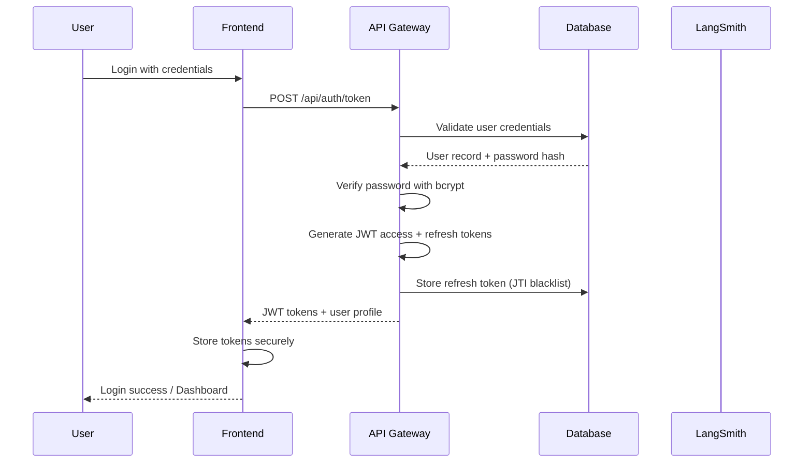

**Detailed Steps:**

1. **User Input**: User enters email and password in login form
2. **Frontend Validation**: Client-side validation for required fields and format
3. **API Request**: POST request to `/api/auth/token` with OAuth2 password flow
4. **Database Query**: User record retrieved by email
5. **Password Verification**: bcrypt comparison with 12-round hashing
6. **Token Generation**: 
   - Access token: HS256, 30-minute expiry, JTI tracking
   - Refresh token: 7-day expiry, single-use rotation
7. **Session Storage**: Refresh token JTI stored in database for blacklisting
8. **Response**: Tokens and user profile returned to frontend
9. **Client Storage**: Tokens stored in httpOnly cookies or secure storage
10. **UI Update**: User redirected to authenticated dashboard

### 3.2 Request Creation Flow

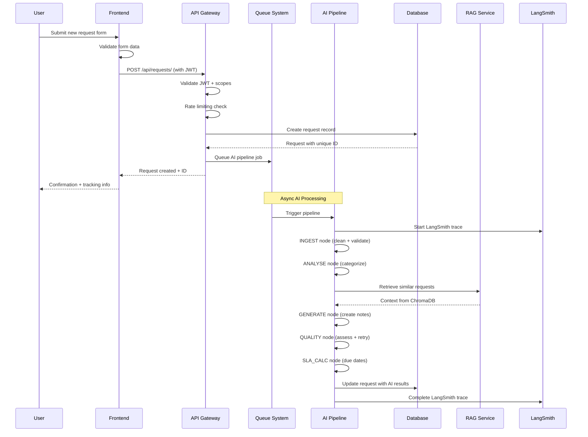

**Detailed Request Creation Process:**

#### Phase 1: Frontend Submission
1. **Form Interaction**: User fills request form with:
   - Title and description
   - Request type (dropdown)
   - Priority level
   - Attachments (optional)
2. **Client Validation**: 
   - Required field validation
   - File type and size checks
   - Character limits enforcement
3. **API Preparation**: Request formatted with JWT authorization header

#### Phase 2: API Gateway Processing
1. **Authentication**: JWT token validated for signature and expiry
2. **Authorization**: User scopes checked for request creation permission
3. **Rate Limiting**: Token bucket algorithm checks request frequency
4. **Input Validation**: Pydantic models validate all input data
5. **Request Creation**: Database record created with:
   - Auto-generated request ID (REQ-XXXXXXX format)
   - Initial status: "Draft"
   - User attribution and timestamps
   - Raw description preserved for audit trail

#### Phase 3: AI Pipeline Execution

**INGEST Node (Text Processing)**
1. **Text Cleaning**: Remove HTML, normalize whitespace, fix encoding
2. **PII Detection**: Identify and redact sensitive information
3. **Content Filtering**: Detect jailbreak attempts, malicious content
4. **Guardrail Validation**: Ensure content is safe for AI processing
5. **Text Normalization**: Standardize formatting and language

**ANALYSE Node (Request Classification)**
1. **Sentiment Analysis**: Determine urgency (Urgent/Neutral)
2. **Intent Recognition**: Categorize request type and purpose
3. **Complexity Assessment**: Evaluate processing difficulty
4. **Tag Generation**: Extract relevant keywords and tags
5. **Confidence Scoring**: Rate analysis reliability

**ENRICH Node (RAG Retrieval)**
1. **Query Construction**: Build semantic search query from request content
2. **Vector Search**: Query ChromaDB for similar historical requests
3. **Context Ranking**: Sort results by relevance score
4. **Context Preparation**: Format retrieved data for AI consumption
5. **Quality Filtering**: Ensure retrieved context meets relevance threshold

**GENERATE Node (Note Creation)**
1. **Context Integration**: Combine request with RAG context
2. **Summary Generation**: Create concise 8-20 word professional summary
3. **Detail Enhancement**: Expand with proper grammar and structure
4. **Action Planning**: Generate concrete next steps
5. **Quality Check**: Initial validation of generated content

**QUALITY Node (Assessment & Retry)**
1. **Quality Scoring**: Evaluate generated notes on 0-100 scale
2. **Threshold Check**: Compare against minimum quality threshold (60)
3. **Improvement Analysis**: Generate specific improvement suggestions
4. **Retry Logic**: If quality < 60, regenerate with feedback (max 3 attempts)
5. **Final Approval**: Mark notes as approved when quality threshold met

**SLA_CALC Node (Service Level Agreement)**
1. **Priority Mapping**: Map business priority to SLA matrix
2. **Due Date Calculation**: Calculate deadline based on request type and priority
3. **Risk Assessment**: Evaluate breach probability (HIGH/MEDIUM/LOW)
4. **Business Priority**: Assign P1/P2 classification
5. **Notification Setup**: Configure alerts for SLA monitoring

#### Phase 4: Post-Processing
1. **Database Update**: Request record updated with AI-generated content
2. **Audit Logging**: All processing steps recorded with timestamps
3. **Indexing**: Approved requests indexed in ChromaDB for future RAG
4. **Notification**: Real-time updates sent via SSE to connected clients
5. **Analytics**: KPIs updated for dashboard and reporting

### 3.3 Request Review and Approval Flow

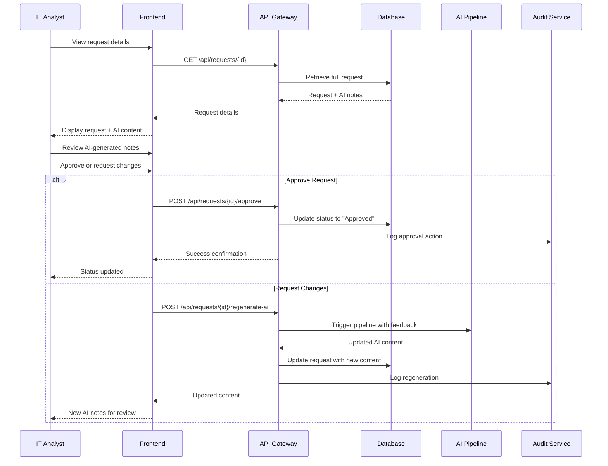

**Detailed Review Process:**

#### Phase 1: Request Retrieval
1. **List View**: Analyst sees request list with AI-generated summaries
2. **Detail View**: Full request displayed with:
   - Original user description
   - AI-generated summary, details, and next actions
   - Quality score and confidence metrics
   - SLA information and due dates
   - Similar historical requests (RAG results)

#### Phase 2: Content Evaluation
1. **Quality Assessment**: Analyst evaluates:
   - Accuracy of AI interpretation
   - Completeness of extracted information
   - Appropriateness of suggested actions
   - Professional tone and grammar
2. **Context Verification**: Cross-reference with:
   - Similar historical requests
   - User's request history
   - Current system status
3. **Decision Making**: Choose to approve or request regeneration

#### Phase 3: Action Execution
**Approval Path:**
1. **Status Update**: Request status changes to "Approved"
2. **Assignment**: Request can be assigned to specific team or individual
3. **SLA Activation**: SLA clock starts for resolution tracking
4. **Notification**: Requestor notified of approval status
5. **Analytics**: Update completion metrics and SLA tracking

**Regeneration Path:**
1. **Feedback Collection**: Analyst provides specific improvement feedback
2. **Pipeline Retrigger**: AI pipeline runs with improvement hints
3. **Enhanced Generation**: Notes regenerated considering feedback
4. **Quality Reassessment**: New quality score calculated
5. **Update Notification**: Analyst notified of updated content

### 3.4 Real-time Progress Tracking Flow

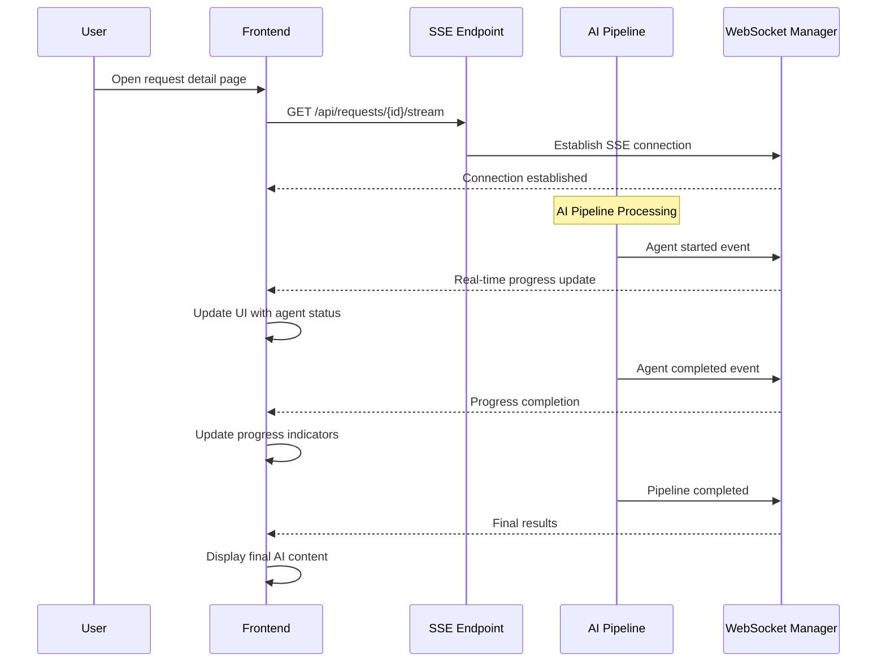

**Real-time Tracking Features:**

#### Phase 1: Connection Establishment
1. **Client Connection**: Frontend establishes SSE connection when request detail opened
2. **Authentication**: Connection validated with JWT token
3. **Channel Subscription**: Client subscribed to specific request updates
4. **Heartbeat**: Regular ping/pong to maintain connection

#### Phase 2: Progress Broadcasting
1. **Agent Events**: Each AI pipeline node broadcasts status changes:
   - Agent started (with timestamp and agent name)
   - Agent progress (percentage completion for long-running tasks)
   - Agent completed (with results and metrics)
2. **UI Updates**: Frontend updates in real-time:
   - Progress bars for each pipeline stage
   - Agent status indicators (running/completed/error)
   - Live quality scores and confidence metrics
3. **Error Handling**: Connection failures trigger automatic reconnection

#### Phase 3: Completion and Cleanup
1. **Final Results**: Complete AI content streamed to client
2. **Connection Closure**: SSE connection closed after pipeline completion
3. **State Synchronization**: Client state synchronized with final database state

---

## 4. Data Flow Architecture

### 4.1 Request Data Model Flow

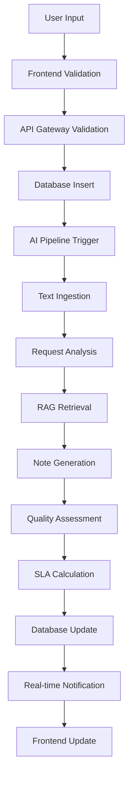

**Data Transformation Stages:**

#### Stage 1: Input Processing
- **Raw Data**: User-submitted form data
- **Validation**: Client and server-side validation
- **Sanitization**: HTML stripping, XSS prevention
- **Normalization**: Standardized formats and encodings

#### Stage 2: Storage and Queuing
- **Persistence**: Initial database record creation
- **Queuing**: Message placed in AI processing queue
- **Audit Trail**: Initial audit log entry created

#### Stage 3: AI Processing
- **Text Enhancement**: Cleaning, normalization, PII redaction
- **Feature Extraction**: Sentiment, intent, complexity analysis
- **Context Enrichment**: RAG retrieval and integration
- **Content Generation**: Professional note creation
- **Quality Assurance**: Scoring and improvement cycles

#### Stage 4: Output Processing
- **Final Storage**: Updated database record with AI results
- **Indexing**: Vector embedding for future RAG operations
- **Notification**: Real-time updates to connected clients
- **Analytics**: KPI updates and metric calculations

### 4.2 AI Pipeline State Management

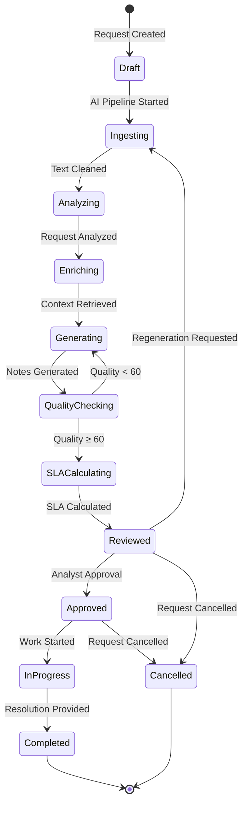

**State Transition Details:**

#### Draft State
- **Entry**: Request initially created by user
- **Valid Transitions**: Ingesting (AI pipeline start), Cancelled
- **Data**: Raw user input, minimal metadata
- **Permissions**: User can edit, delete; Analyst can view

#### Ingesting State
- **Entry**: AI pipeline text processing started
- **Valid Transitions**: Analyzing (success), Draft (failure)
- **Data**: Cleaned text, guardrail validation results
- **Processing**: PII redaction, content filtering

#### Analyzing State
- **Entry**: Request classification in progress
- **Valid Transitions**: Enriching (success), Ingesting (retry)
- **Data**: Sentiment, intent, complexity, tags, confidence
- **Processing**: CrewAI/AutoGen agent analysis

#### Enriching State
- **Entry**: RAG context retrieval active
- **Valid Transitions**: Generating (success), Analyzing (retry)
- **Data**: Similar historical requests, context embeddings
- **Processing**: ChromaDB semantic search

#### Generating State
- **Entry**: Professional note creation
- **Valid Transitions**: QualityChecking (success), Enriching (retry)
- **Data**: AI summary, details, next actions
- **Processing**: CrewAI note generation with RAG context

#### QualityChecking State
- **Entry**: Quality assessment in progress
- **Valid Transitions**: 
  - SLACalculating (quality ≥ 60)
  - Generating (quality < 60, retry)
- **Data**: Quality score, improvement suggestions
- **Processing**: Quality guard agent evaluation

#### SLACalculating State
- **Entry**: Service level agreement calculation
- **Valid Transitions**: Reviewed (success)
- **Data**: Due dates, breach risk, business priority
- **Processing**: SLA matrix application

#### Reviewed State
- **Entry**: AI processing complete, ready for human review
- **Valid Transitions**: Approved, Ingesting (regeneration), Cancelled
- **Data**: Complete AI-generated content, metadata
- **Permissions**: Analyst can approve, regenerate; User can view

#### Approved State
- **Entry**: Human approval received
- **Valid Transitions**: InProgress, Cancelled
- **Data**: Approval metadata, assignment information
- **SLA**: Resolution clock starts

#### InProgress State
- **Entry**: Work actively being performed
- **Valid Transitions**: Completed, Cancelled
- **Data**: Work progress, time tracking
- **Monitoring**: SLA compliance tracking

#### Completed State
- **Entry**: Resolution provided and confirmed
- **Valid Transitions**: [*] (terminal)
- **Data**: Final resolution details, time metrics
- **Archive**: Moved to historical storage

#### Cancelled State
- **Entry**: Request cancelled by user or system
- **Valid Transitions**: [*] (terminal)
- **Data**: Cancellation reason, timestamp
- **Archive**: Retained for audit and analytics

---

## 5. Integration Flows

### 5.1 Email Integration Flow

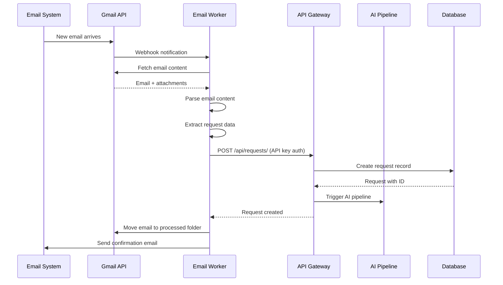

**Email Processing Details:**

#### Phase 1: Email Reception
1. **Gmail Integration**: OAuth2 authentication with Gmail API
2. **Webhook Setup**: Push notifications for new emails
3. **Authentication**: Secure API key authentication for system access
4. **Rate Limiting**: Respect Gmail API quotas and limits

#### Phase 2: Content Extraction
1. **Email Parsing**: Extract headers, body, attachments
2. **Content Cleaning**: Remove email signatures, forwarding headers
3. **Attachment Handling**: Process and store file attachments
4. **Metadata Extraction**: Identify sender, priority, urgency indicators

#### Phase 3: Request Creation
1. **Data Mapping**: Map email fields to request structure
2. **User Identification**: Match sender to system user
3. **Default Assignment**: Apply default request types and priorities
4. **API Submission**: Create request via internal API

#### Phase 4: Processing and Response
1. **AI Pipeline**: Standard AI processing workflow
2. **Email Confirmation**: Send confirmation with request ID
3. **Status Updates**: Optional email notifications for status changes
4. **Email Organization**: Move processed emails to appropriate folders

### 5.2 AI Framework Integration Flow

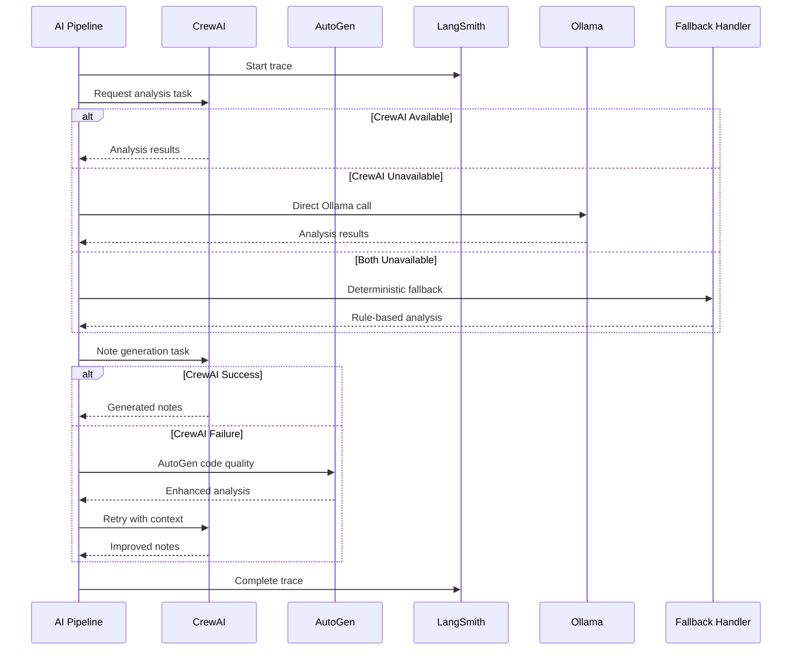

**AI Framework Coordination:**

#### Framework Selection Logic
1. **Primary Choice**: CrewAI for most tasks (multi-agent collaboration)
2. **Secondary Choice**: Ollama for direct LLM access (fallback)
3. **Tertiary Choice**: AutoGen for specialized code analysis
4. **Final Fallback**: Deterministic rule-based processing

#### Error Handling and Graceful Degradation
1. **Health Monitoring**: Continuous framework availability checking
2. **Automatic Failover**: Seamless switching between frameworks
3. **Quality Assurance**: Output validation regardless of source
4. **Performance Optimization**: Framework selection based on task requirements

#### LangSmith Integration
1. **Trace Initialization**: Start trace for each pipeline execution
2. **Step Tracking**: Record each framework interaction
3. **Performance Metrics**: Capture timing, token usage, costs
4. **Error Logging**: Detailed error information for debugging
5. **Trace Completion**: Final results and summary statistics

---

## 6. Security Flow

### 6.1 Authentication and Authorization Flow

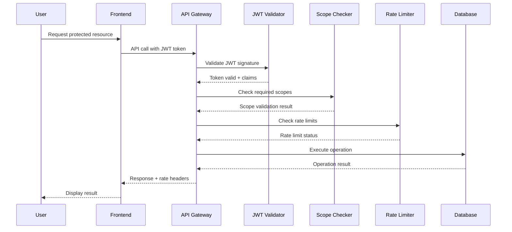

**Security Layer Details:**

#### JWT Token Management
1. **Token Structure**: Header, payload (claims), signature
2. **Claims**: User ID, scopes, expiry, issuer, audience
3. **Signature Verification**: RS256 asymmetric encryption
4. **Token Refresh**: Automatic refresh token rotation

#### Scope-Based Access Control
1. **Scope Definitions**: read, write, admin, agents:exec, rag:admin
2. **Endpoint Protection**: Each API endpoint requires specific scopes
3. **Permission Inheritance**: Higher scopes include lower scope permissions
4. **Dynamic Scoping**: User-specific resource access controls

#### Rate Limiting Implementation
1. **Token Bucket Algorithm**: Fair distribution with burst tolerance
2. **Per-IP Tracking**: Individual rate limits per client IP
3. **Endpoint-Specific Limits**: Different limits for different endpoint types
4. **Headers**: Rate limit information included in all responses

### 6.2 Data Protection Flow

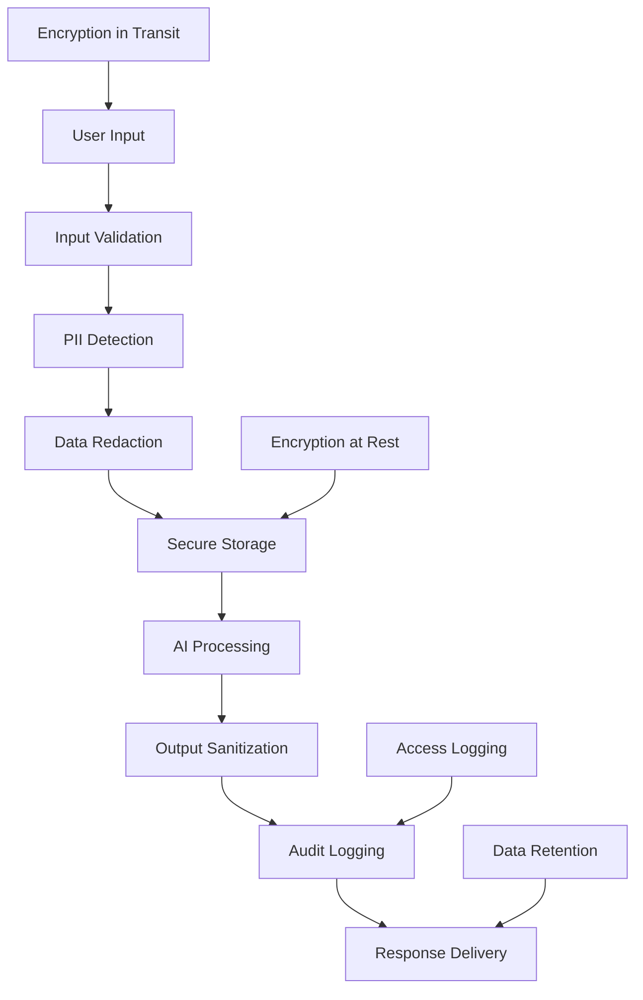

**Data Protection Measures:**

#### Input Security
1. **Validation**: Pydantic strict mode validation
2. **Sanitization**: HTML stripping, XSS prevention
3. **Size Limits**: Maximum input sizes enforced
4. **Type Checking**: Strict data type validation

#### PII Protection
1. **Detection**: AI-powered PII identification
2. **Redaction**: Automatic sensitive data masking
3. **Storage**: Encrypted storage for sensitive data
4. **Access**: Role-based access to PII data

#### Audit and Compliance
1. **Immutable Logs**: Tamper-evident audit trails
2. **Access Tracking**: All data access logged
3. **Retention Policies**: Automated data lifecycle management
4. **Compliance Reporting**: Regular compliance status reports

---

## 7. Monitoring and Observability Flow

### 7.1 Application Monitoring Flow

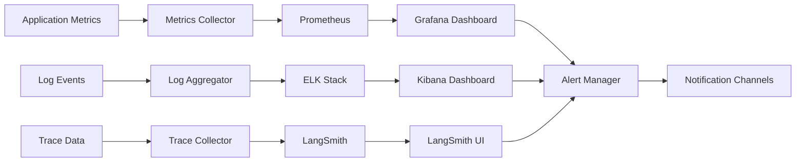

**Monitoring Components:**

#### Metrics Collection
1. **Application Metrics**: Response times, throughput, error rates
2. **Business Metrics**: Request processing times, SLA compliance
3. **Infrastructure Metrics**: CPU, memory, disk, network usage
4. **AI Pipeline Metrics**: Agent performance, quality scores

#### Logging Strategy
1. **Structured Logging**: JSON format with consistent schema
2. **Correlation IDs**: Request tracking across services
3. **Log Levels**: Appropriate severity classification
4. **Log Retention**: Configurable retention policies

#### Distributed Tracing
1. **Request Tracing**: End-to-end request flow tracking
2. **AI Pipeline Tracing**: Detailed agent execution tracking
3. **Performance Analysis**: Bottleneck identification
4. **Error Correlation**: Error context and impact analysis

### 7.2 Alerting Flow

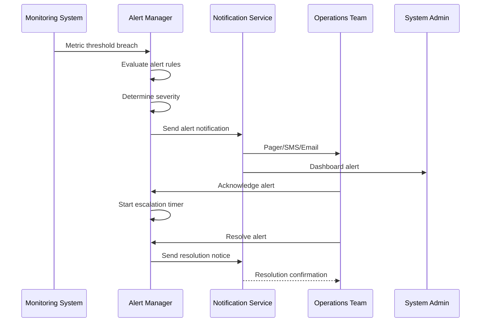

**Alerting Strategy:**

#### Alert Classification
1. **Critical**: System downtime, security incidents, data loss
2. **High**: Performance degradation, SLA breaches
3. **Medium**: Resource utilization warnings
4. **Low**: Informational notifications

#### Escalation Policies
1. **Immediate Response**: Critical alerts within 5 minutes
2. **Standard Response**: High alerts within 15 minutes
3. **Scheduled Response**: Medium alerts during business hours
4. **Batch Processing**: Low alerts in daily summaries

---

## 8. Performance Optimization Flow

### 8.1 Request Processing Optimization

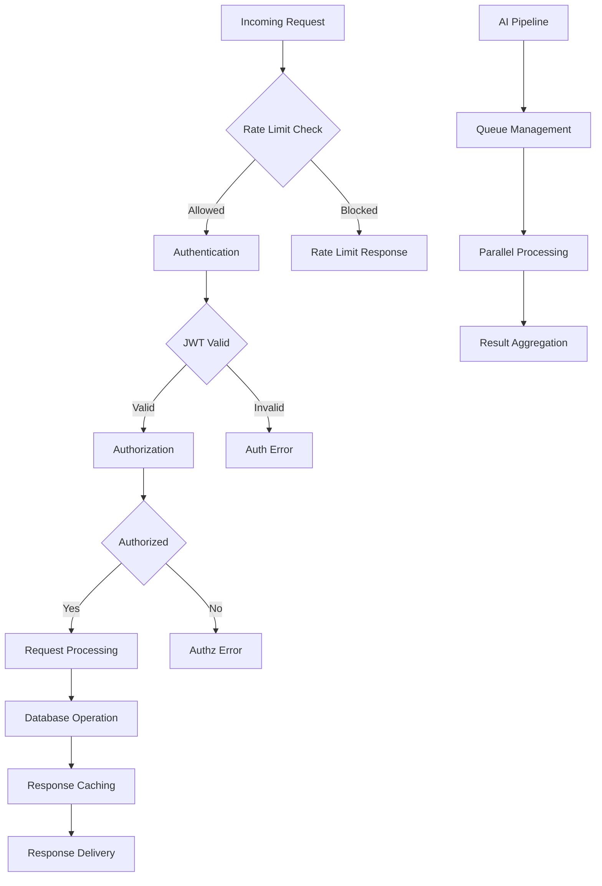

**Optimization Techniques:**

#### Request Handling
1. **Connection Pooling**: Reuse database connections
2. **Request Caching**: Cache frequent request responses
3. **Load Balancing**: Distribute load across instances
4. **Async Processing**: Non-blocking I/O operations

#### AI Pipeline Optimization
1. **Parallel Processing**: Multiple agents run concurrently
2. **Result Caching**: Cache AI results for similar requests
3. **Queue Management**: Prioritize high-priority requests
4. **Resource Management**: Optimize GPU/CPU usage

### 8.2 Database Optimization Flow

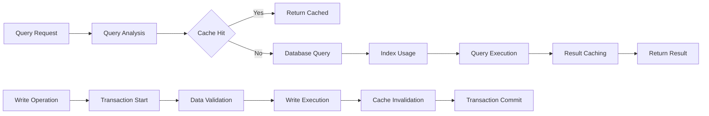

**Database Performance Measures:**

#### Query Optimization
1. **Index Strategy**: Optimal index design for query patterns
2. **Query Analysis**: Regular query performance analysis
3. **Connection Pooling**: Efficient connection management
4. **Read Replicas**: Distribute read operations

#### Caching Strategy
1. **Application Cache**: In-memory caching for frequent data
2. **Query Cache**: Cache query results
3. **Session Cache**: User-specific data caching
4. **Cache Invalidation**: Intelligent cache invalidation

---

## 9. Error Handling and Recovery Flow

### 9.1 Error Handling Strategy

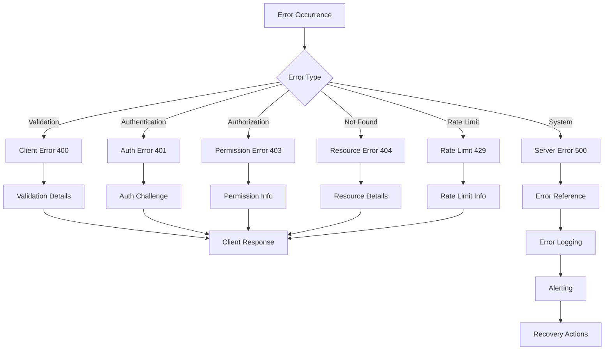

**Error Handling Categories:**

#### Client Errors (4xx)
1. **Validation Errors**: Input validation failures
2. **Authentication Errors**: Invalid or expired credentials
3. **Authorization Errors**: Insufficient permissions
4. **Resource Errors**: Requested resource not found
5. **Rate Limit Errors**: Too many requests

#### Server Errors (5xx)
1. **Database Errors**: Connection or query failures
2. **AI Service Errors**: AI framework unavailability
3. **System Errors**: Infrastructure failures
4. **Integration Errors**: Third-party service failures

### 9.2 Recovery and Fallback Flow

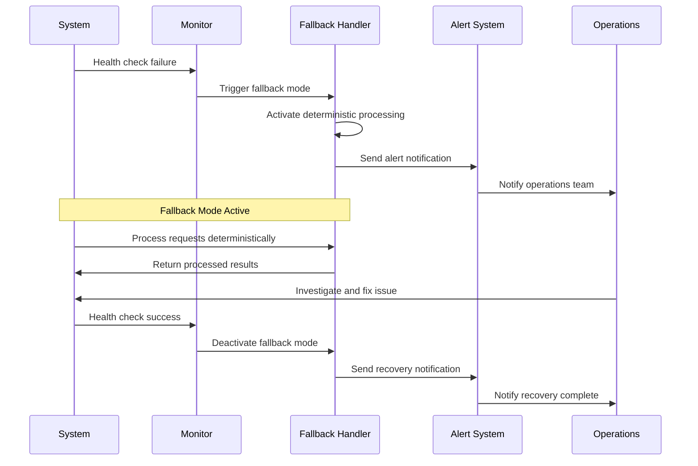

**Recovery Strategies:**

#### Graceful Degradation
1. **AI Service Fallback**: Rule-based processing when AI unavailable
2. **Database Fallback**: Read-only mode during database issues
3. **Cache Fallback**: Direct database access when cache fails
4. **Service Degradation**: Reduced functionality during high load

#### Automatic Recovery
1. **Health Monitoring**: Continuous service health checks
2. **Circuit Breakers**: Prevent cascade failures
3. **Auto-restart**: Automatic service restart on failure
4. **Load Redistribution**: Redistribute load during failures

---

## 10. Deployment and Scaling Flow

### 10.1 Deployment Pipeline Flow

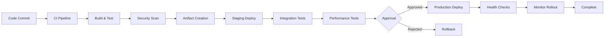

**Deployment Process:**

#### Continuous Integration
1. **Code Quality**: Automated code quality checks
2. **Unit Testing**: Comprehensive unit test suite
3. **Security Scanning**: Vulnerability assessment
4. **Artifact Creation**: Container image building

#### Deployment Strategy
1. **Blue-Green Deployment**: Zero-downtime deployments
2. **Canary Releases**: Gradual rollout with monitoring
3. **Rollback Capability**: Quick rollback on issues
4. **Health Validation**: Post-deployment health checks

### 10.2 Auto-scaling Flow

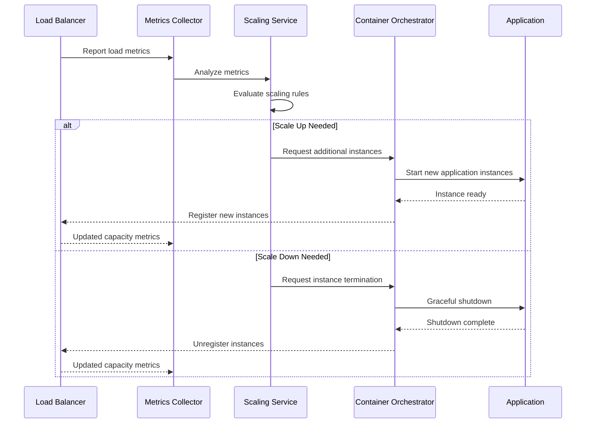

**Scaling Strategies:**

#### Horizontal Scaling
1. **Load-Based Scaling**: Scale based on CPU/memory usage
2. **Request-Based Scaling**: Scale based on request queue length
3. **Time-Based Scaling**: Scale based on predictable patterns
4. **Cost Optimization**: Balance performance and cost

#### Resource Management
1. **Resource Limits**: Define resource constraints
2. **Health Monitoring**: Monitor instance health
3. **Graceful Shutdown**: Handle instance termination
4. **Load Distribution**: Even traffic distribution

---

## 11. Conclusion

The NEXUS SDLC system implements a comprehensive end-to-end flow that seamlessly integrates user interactions, AI processing, and system operations. The architecture ensures:

### 11.1 Key Strengths
- **Reliability**: Robust error handling and graceful degradation
- **Performance**: Optimized processing with real-time updates
- **Security**: Comprehensive security measures at all layers
- **Scalability**: Horizontal scaling with auto-scaling capabilities
- **Maintainability**: Clean architecture with comprehensive monitoring

### 11.2 Innovation Highlights
- **Multi-Framework AI**: Leveraging CrewAI, AutoGen, and LangGraph optimally
- **Self-Correcting Pipeline**: Quality-driven retry mechanisms
- **Real-time Processing**: Live progress tracking via SSE
- **Graceful Degradation**: 100% uptime during AI service interruptions
- **Comprehensive Observability**: Full tracing and monitoring integration

### 11.3 Operational Excellence
- **Automation**: Automated deployment, scaling, and recovery
- **Monitoring**: Comprehensive metrics, logging, and alerting
- **Security**: Defense-in-depth security approach
- **Performance**: Optimized for high throughput and low latency
- **Compliance**: Built-in audit trails and data protection

This end-to-end system flow documentation provides the foundation for understanding, implementing, and maintaining the NEXUS SDLC platform with confidence in its reliability, security, and performance characteristics.

---

## 12. Sign-off

This end-to-end system flow documentation has been reviewed and approved by:

**Technical Review:**
- [ ] System Architect
- [ ] AI/ML Engineer
- [ ] DevOps Engineer
- [ ] Security Engineer

**Business Review:**
- [ ] Product Manager
- [ ] Operations Manager
- [ ] Quality Assurance Lead

**Date of Approval**: ________________

**Version History:**
- v1.0 - March 2026 - Initial comprehensive release
